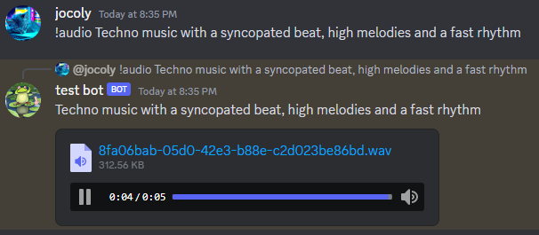
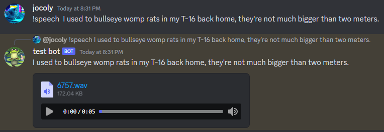
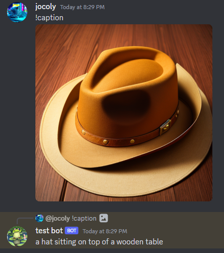
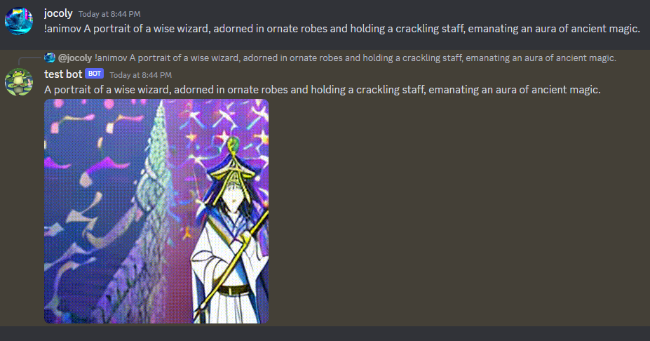
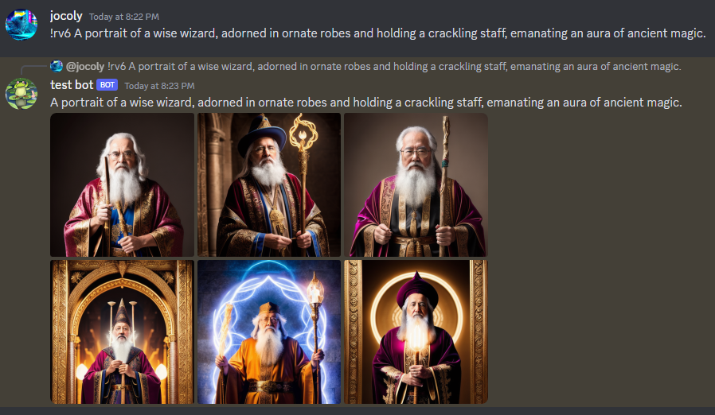
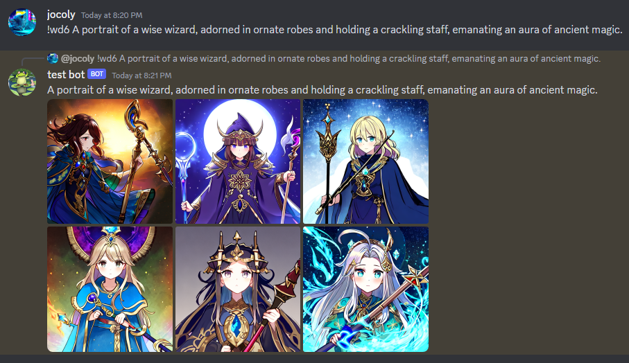
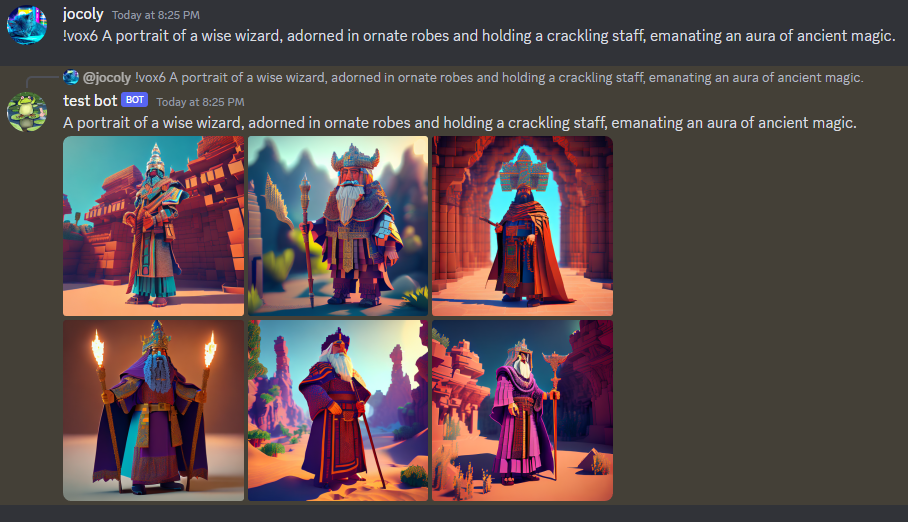

# Discord AI Sandbox

## A Discord interface for some of Huggingface's most popular AI media models

There are 18 supported commands; a full list of the incorporated Huggingface models is at the bottom of this page.

Everything is locally hosted via a backend Python server. A FIFO queue in the Discord bot limits processing to one request at a time.

You'll need 16 GB minimum VRAM to run the video pipelines. Everything else *can* run on CPU, but not very quickly.

Settings can be tweaked in a dotenv file. Copy the template below and add it to the root directory.

Make sure your bot has Guilds and GuildMessages intents enabled in the server you want to use it in.

### Demos use the following prompt:
`A portrait of a wise wizard, adorned in ornate robes and holding a crackling staff, emanating an aura of ancient magic.`

## Commands:

Sending a command enqueues the request and the bot will reply with the result.

All image generation commands can be used with an integer <= MAX_NUM_IMAGES in your .env file to generate multiple images (default is 1).
    
Ex:

    !draw4 A robot hitting the dougie

Commands marked with * can be sent either as standalone messages with a file attachment, or as a reply to a message with a file attachment.

`!test

Sends a test response to show that the bot is working.

#### !chat

[OpenAI ChatGPT](https://platform.openai.com/docs/guides/gpt) (text-davinci-003)

#### !ask

[google/flan-t5-large](https://huggingface.co/google/flan-t5-large)

#### !drawX <prompt>

[stabilityai/stable-diffusion-2-1](https://huggingface.co/stabilityai/stable-diffusion-2-1)

#### !video <prompt>

[damo-vilab/text-to-video-ms-1.7b](https://huggingface.co/damo-vilab/text-to-video-ms-1.7b)

#### !audio <prompt>

[cvssp/audioldm-s-full-v2](https://huggingface.co/cvssp/audioldm-s-full-v2)

[8fa06bab-05d0-42e3-b88e-c2d023be86bd.wav](..%2F..%2FDownloads%2F8fa06bab-05d0-42e3-b88e-c2d023be86bd.wav)

#### !speech <prompt>

[microsoft/speecht5_tts](https://huggingface.co/microsoft/speecht5_tts)

[6757.wav](..%2F..%2FDownloads%2F6757.wav)

#### !img2img <prompt>

[runwayml/stable-diffusion-v1-5](https://huggingface.co/runwayml/stable-diffusion-v1-5)

#### !upscale

[stabilityai/sd-x2-latent-upscaler](https://huggingface.co/stabilityai/sd-x2-latent-upscaler)

Input (512x512):

Result (1024x1024):

#### !caption

[nlpconnect/vit-gpt2-image-captioning](https://huggingface.co/nlpconnect/vit-gpt2-image-captioning)

#### !xlvid <prompt>

[cerspense/zeroscope_v2_576w](https://huggingface.co/cerspense/zeroscope_v2_576w)

#### !animov <prompt>

[strangeman3107/animov-512x](https://huggingface.co/strangeman3107/animov-512x)

And the following work just like !drawX but use different models:

#### !realistic/!rv

[SG161222/Realistic_Vision_V2.0](https://huggingface.co/SG161222/Realistic_Vision_V2.0)

    
#### !openjourney/!oj

[prompthero/openjourney](https://huggingface.co/prompthero/openjourney)

    
#### !dreamshaper/!ds

[Lykon/DreamShaper](https://huggingface.co/Lykon/DreamShaper)

    
#### !anything

[Linaqruf/anything-v3.0](https://huggingface.co/Linaqruf/anything-v3.0)

    
#### !photoreal/!pr

[dreamlike-art/dreamlike-photoreal-2.0](https://huggingface.co/dreamlike-art/dreamlike-photoreal-2.0)

#### !waifu/!wd

[hakurei/waifu-diffusion](https://huggingface.co/hakurei/waifu-diffusion)

#### !vox

[plasmo/vox2](https://huggingface.co/plasmo/vox2)

## To run:

-Clone the repo and copy the following into a new file called '.env' saved in the root directory of the project.

    DISCORD_TOKEN=<Your token here>
    DISCORD_CHANNEL_ID=<Channel ID if CONTAIN_BOT==true>
    OPENAI_TOKEN=<Your token here>

    OUTPUT_DIR=./output/images/
    BACKEND_ADDRESS=127.0.0.1
    PORT=8001
    
    CONTAIN_BOT=true
    DELETE_AFTER_SENDING=true
    MAX_NUM_IMAGES=6
    
    CHAT=true
    ASK=true
    STABLE_DIFFUSION=true
    TEXT_TO_VIDEO=true
    TEXT_TO_AUDIO=true
    TEXT_TO_SPEECH=true
    IMAGE_TO_IMAGE=true
    CAPTION=true
    ANIMOV_512X=true
    XL_VIDEO=true
    UPSCALE=true
    REALISTIC_VISION=true
    OPENJOURNEY=true
    DREAM_SHAPER=true
    ANYTHING_V3=true
    DREAMLIKE_PHOTOREAL=true
    WAIFU_DIFFUSION=true
    VOX2=true
    
    CHAT_TEMPERATURE=0.7
    CHAT_PROMPT_MAX_TOKENS=500
    CHAT_MODEL=text-davinci-003
    
    SD_IMAGE_INFERENCE_STEPS=50
    SD_IMAGE_GUIDANCE_SCALE=7.5
    SD_IMAGE_WIDTH=512
    SD_IMAGE_HEIGHT=512
    
    VIDEO_INFERENCE_STEPS=50
    VIDEO_GUIDANCE_SCALE=7.5
    VIDEO_NUM_FRAMES=24
    VIDEO_WIDTH=256
    VIDEO_HEIGHT=256
    
    AUDIO_INFERENCE_STEPS=10
    AUDIO_LENGTH_IN_SECONDS=5.0
    
    IMG2IMG_INFERENCE_STEPS=50
    IMG2IMG_GUIDANCE_SCALE=7.5
    IMG2IMG_STRENGTH=0.75
    
    RV_INFERENCE_STEPS=50
    RV_GUIDANCE_SCALE=7.5
    RV_IMAGE_WIDTH=512
    RV_IMAGE_HEIGHT=512
    
    OJ_INFERENCE_STEPS=50
    OJ_GUIDANCE_SCALE=7.5
    OJ_IMAGE_WIDTH=512
    OJ_IMAGE_HEIGHT=512
    
    DS_INFERENCE_STEPS=50
    DS_GUIDANCE_SCALE=7.5
    DS_IMAGE_WIDTH=512
    DS_IMAGE_HEIGHT=512
    
    ANYTHING_INFERENCE_STEPS=50
    ANYTHING_GUIDANCE_SCALE=7.5
    ANYTHING_IMAGE_WIDTH=512
    ANYTHING_IMAGE_HEIGHT=512
    
    PR_INFERENCE_STEPS=50
    PR_GUIDANCE_SCALE=7.5
    PR_IMAGE_WIDTH=768
    PR_IMAGE_HEIGHT=768
    
    WD_INFERENCE_STEPS=50
    WD_GUIDANCE_SCALE=7.5
    WD_IMAGE_WIDTH=512
    WD_IMAGE_HEIGHT=512
    
    VOX2_INFERENCE_STEPS=50
    VOX2_GUIDANCE_SCALE=7.5
    VOX2_IMAGE_WIDTH=512
    VOX2_IMAGE_HEIGHT=512
    
    NEGATIVE_PROMPT=blurry, watermark, gross, disgusting, text, close up, cropped, out of frame, worst quality, low quality, jpeg artifacts, ugly, duplicate, morbid, mutilated, extra fingers, mutated hands, poorly drawn hands, poorly drawn face, mutation, deformed, blurry, dehydrated, bad anatomy, bad proportions, extra limbs, cloned face, disfigured, gross proportions, malformed limbs, missing arms, missing legs, extra arms, extra legs, fused fingers, too many fingers, long neck

-Install Python requirements
    
    pip install -r "requirements.txt"

-Install Node.js requirements

    npm install

-Start the backend server (will take a while to download the models the first time)
    
    python main.py

-In a new terminal window, start the bot

    node bot.js

### Huggingface Models:
[google/flan-t5-large](https://huggingface.co/google/flan-t5-large)
[cvssp/audioldm-s-full-v2](https://huggingface.co/cvssp/audioldm-s-full-v2)
[microsoft/speecht5_tts](https://huggingface.co/microsoft/speecht5_tts)
[nlpconnect/vit-gpt2-image-captioning](https://huggingface.co/nlpconnect/vit-gpt2-image-captioning)
[stabilityai/stable-diffusion-2-1](https://huggingface.co/stabilityai/stable-diffusion-2-1)
[runwayml/stable-diffusion-v1-5](https://huggingface.co/runwayml/stable-diffusion-v1-5)
[stabilityai/sd-x2-latent-upscaler](https://huggingface.co/stabilityai/sd-x2-latent-upscaler)
[damo-vilab/text-to-video-ms-1.7b](https://huggingface.co/damo-vilab/text-to-video-ms-1.7b)
[cerspense/zeroscope_v2_576w](https://huggingface.co/cerspense/zeroscope_v2_576w)
[strangeman3107/animov-512x](https://huggingface.co/strangeman3107/animov-512x)
[SG161222/Realistic_Vision_V2.0](https://huggingface.co/SG161222/Realistic_Vision_V2.0)
[prompthero/openjourney](https://huggingface.co/prompthero/openjourney)
[Lykon/DreamShaper](https://huggingface.co/Lykon/DreamShaper)
[Linaqruf/anything-v3.0](https://huggingface.co/Linaqruf/anything-v3.0)
[dreamlike-art/dreamlike-photoreal-2.0](https://huggingface.co/dreamlike-art/dreamlike-photoreal-2.0)
[hakurei/waifu-diffusion](https://huggingface.co/hakurei/waifu-diffusion)
[plasmo/vox2](https://huggingface.co/plasmo/vox2)
